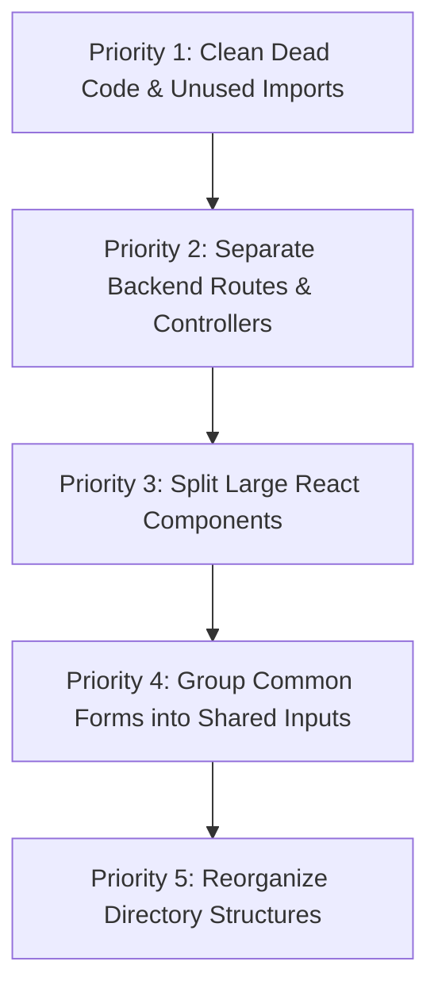

# Production Audit Report & Cleanup Blueprint

This document represents a comprehensive production-grade audit of the **AWS Student Builder Group (SBG) Parul University** repository. It catalogs the complete codebase inventory, analyzes each component, backend endpoint, and database model, detects dead/duplicated code, and establishes a prioritized refactoring roadmap.

---

## Phase 1 — Repository Inventory

### Folder Directory Map
```
.
├── apps/
│   ├── backend/
│   │   ├── package.json
│   │   └── index.js
│   └── frontend/
│       ├── package.json
│       ├── eslint.config.js
│       ├── index.html
│       ├── vite.config.js
│       ├── public/
│       └── src/
│           ├── App.jsx
│           ├── main.jsx
│           ├── index.css
│           ├── assets/
│           ├── lib/
│           ├── data/
│           ├── components/
│           ├── context/
│           └── pages/
├── database/
│   └── prisma/
│       ├── package.json
│       └── schema.prisma
├── docs/
│   └── (Documentation)
├── infrastructure/
│   └── (Deployment / IAC Configurations)
├── package.json
└── package-lock.json
```

### Source File Inventory

| File Path | Size (Bytes) | Lines | Purpose | Used? | Imported? | Duplicated? | Obsolete? |
| :--- | :--- | :--- | :--- | :--- | :--- | :--- | :--- |
| `apps/backend/index.js` | 12,998 | 479 | Express backend API entrypoint, routes, and auth middleware | Yes | Entry | No | No |
| `apps/frontend/src/main.jsx` | 342 | 13 | React application render root with StrictMode & ErrorBoundary | Yes | Entry | No | No |
| `apps/frontend/src/App.jsx` | 3,641 | 96 | Router path setup, public/private layouts, and guard nesting | Yes | Yes | No | No |
| `apps/frontend/src/lib/supabase.js` | 822 | 26 | Safe Supabase client wrapper with fallback guards | Yes | Yes | No | No |
| `apps/frontend/src/lib/api.js` | 2,618 | 77 | Fetch API handler wrapper for all backend server communication | Yes | Yes | No | No |
| `apps/frontend/src/data/team.js` | 814 | 16 | Hardcoded initial team backup info | Yes | No | No | Yes |
| `apps/frontend/src/components/Navbar.jsx` | 5,115 | 106 | Responsive navigation header with light/dark theme toggles | Yes | Yes | No | No |
| `apps/frontend/src/components/Leadership.jsx` | 1,984 | 52 | Section rendering static community leadership information | Yes | Yes | No | No |
| `apps/frontend/src/components/MemberCard.jsx` | 4,246 | 98 | Card rendering detailed team builder credentials & profile bio | Yes | Yes | No | No |
| `apps/frontend/src/components/ErrorBoundary.jsx` | 1,885 | 68 | Fallback crash screen handler for React component tree | Yes | Yes | No | No |
| `apps/frontend/src/components/Sprints.jsx` | 4,464 | 92 | Section rendering builder sprint activities & projects | Yes | Yes | No | No |
| `apps/frontend/src/components/MetricsGrid.jsx` | 2,595 | 52 | Community metric counters (e.g., certifications, members) | Yes | Yes | No | No |
| `apps/frontend/src/components/Footer.jsx` | 9,760 | 202 | Informational Footer with link lists and dynamic year output | Yes | Yes | No | No |
| `apps/frontend/src/components/Hero.jsx` | 6,471 | 117 | Visual introductory hero header with metric counters | Yes | Yes | No | No |
| `apps/frontend/src/components/TerminalConsole.jsx` | 5,764 | 163 | Terminal simulator visualizer showing micro-sprint tasks | Yes | Yes | No | No |
| `apps/frontend/src/components/HomeSections.jsx` | 14,570 | 287 | Unified event lists, user user-groups links, and collabs | Yes | Yes | No | No |
| `apps/frontend/src/components/dashboard/DashboardLayout.jsx` | 8,273 | 176 | Dashboard shell layout, sidebar navigation, profile info bar | Yes | Yes | No | No |
| `apps/frontend/src/components/dashboard/DashboardGuard.jsx` | 5,906 | 152 | Dashboard route security guard with profile sync checking | Yes | Yes | No | No |
| `apps/frontend/src/context/AuthContext.jsx` | 3,459 | 123 | Central Auth provider for signin, signup, signout state | Yes | Yes | No | No |
| `apps/frontend/src/context/ThemeContext.jsx` | 691 | 23 | Simple localStorage-persisted light/dark context provider | Yes | Yes | No | No |
| `apps/frontend/src/pages/Home.jsx` | 550 | 20 | Entry point rendering homepage blocks | Yes | Yes | No | No |
| `apps/frontend/src/pages/about/index.jsx` | 25,634 | 460 | Static About Page detailing group mission, sprints, values | Yes | Yes | No | No |
| `apps/frontend/src/pages/team/index.jsx` | 3,556 | 97 | Team listing page fetching profiles from backend | Yes | Yes | No | No |
| `apps/frontend/src/pages/team/[slug].jsx` | 11,177 | 241 | Detailed individual builder card profiles page | Yes | Yes | No | No |
| `apps/frontend/src/pages/contact/index.jsx` | 13,259 | 268 | Contact & query submission page | Yes | Yes | No | No |
| `apps/frontend/src/pages/events/index.jsx` | 13,004 | 297 | Event calendar & listing view | Yes | Yes | No | No |
| `apps/frontend/src/pages/portal/index.jsx` | 3,090 | 64 | Certification validation entrypoint | Yes | Yes | No | No |
| `apps/frontend/src/pages/portal/verify.jsx` | 9,217 | 208 | Certificate verification display page | Yes | Yes | No | No |
| `apps/frontend/src/pages/dashboard/index.jsx` | 14,131 | 242 | Leaderboard and stats overview dashboard page | Yes | Yes | No | No |
| `apps/frontend/src/pages/dashboard/events.jsx` | 14,437 | 285 | Administrator event manager table interface | Yes | Yes | No | No |
| `apps/frontend/src/pages/dashboard/certifications.jsx` | 12,755 | 261 | Cert verification and social post generator dashboard page | Yes | Yes | No | No |
| `apps/frontend/src/pages/dashboard/badge.jsx` | 9,972 | 210 | Custom credential badge visualizer & image downloader | Yes | Yes | No | No |
| `apps/frontend/src/pages/dashboard/members.jsx` | 20,058 | 367 | Member profile approval and role modification list | Yes | Yes | No | No |
| `apps/frontend/src/pages/dashboard/login.jsx` | 9,508 | 204 | Login, Sign up, and Google OAuth dashboard landing page | Yes | Yes | No | No |
| `apps/frontend/src/pages/dashboard/settings.jsx` | 9,976 | 183 | Registration switches and configs page | Yes | Yes | No | No |
| `apps/frontend/src/pages/dashboard/set-password.jsx` | 7,117 | 181 | Initial password setter for new user accounts | Yes | Yes | No | No |
| `apps/frontend/src/pages/dashboard/team.jsx` | 13,087 | 244 | core builder list management dashboard page | Yes | Yes | No | No |
| `apps/frontend/src/pages/certify/index.jsx` | 22,889 | 527 | Cert validation request & PDF upload form page | Yes | Yes | No | No |
| `apps/frontend/src/pages/Home.jsx` | 550 | 20 | Entry point rendering homepage blocks | Yes | Yes | No | No |
| `apps/frontend/src/pages/404.jsx` | 5,490 | 126 | Custom interactive terminal 404 page | Yes | Yes | No | No |
| `database/prisma/schema.prisma` | 2,646 | 94 | Database models, schemas, and relation constraints | Yes | Setup | No | No |

---

## Phase 2 — File-by-File Analysis

### Backend Component

#### `apps/backend/index.js`
*   **Purpose**: Server application API entrypoint handling Express routing and DB interaction.
*   **Responsibilities**: Configuration of environment variables, initialization of PrismaClient, verification of Supabase auth tokens, route mapping, profile auto-sync, database query orchestration.
*   **Exports**: Implicitly none (Node daemon/Process).
*   **Imports**: `express`, `cors`, `dotenv`, `@prisma/client`, `@supabase/supabase-js`, `path`, `url`.
*   **Dependencies**: Prisma engine client, Express router core, CORS CORS headers, Supabase Node core wrapper.
*   **Used By**: Runtime node execution environment.
*   **SRP Rating**: Fails. Houses authentication middleware, system initialization, seed functions, and 12 distinct routes across profiles, events, settings, certifications, and verification.
*   **Complexity**: Medium-High.
*   **Maintainability**: Poor. Difficult to split and scale routing logic or write isolated unit tests without mocking the entire file.
*   **Code Quality**: Medium. Inline SQL configurations, inline transaction arrays, and hardcoded default settings.

---

### Core Frontend Library Components

#### `apps/frontend/src/main.jsx`
*   **Purpose**: React application mount point.
*   **Responsibilities**: Hooks React virtual DOM into the document element `#root`. Wraps rendering in `StrictMode` and `ErrorBoundary`.
*   **Exports**: None.
*   **Imports**: `React`, `ReactDOM`, `App`, `ErrorBoundary`, `index.css`.
*   **Dependencies**: React DOM rendering engine.
*   **Used By**: Served output script of Vite compiler.
*   **SRP Rating**: Passes. Simply handles bootstrapping.
*   **Complexity**: Extremely Low.
*   **Maintainability**: High.
*   **Code Quality**: High.

#### `apps/frontend/src/App.jsx`
*   **Purpose**: Global routing definition and layout wrapper.
*   **Responsibilities**: Configures React Router paths for public layout grids, nested layouts, and secure dashboard structures protected by `DashboardGuard`.
*   **Exports**: `default App` component.
*   **Imports**: React hooks, `react-router-dom` utilities, `ThemeContext`, `AuthContext`, `Navbar`, `Footer`, all page containers.
*   **Dependencies**: React router routing hooks.
*   **Used By**: `main.jsx`.
*   **SRP Rating**: Passes. Exclusively dictates structural routing.
*   **Complexity**: Low-Medium.
*   **Maintainability**: Medium. Route lists are growing long; could benefit from lazy loading/dynamic imports.
*   **Code Quality**: High. Clear separation of public and private sub-trees.

#### `apps/frontend/src/lib/supabase.js`
*   **Purpose**: Supabase Client initialization.
*   **Responsibilities**: Safely evaluates environment variables to prevent startup crashes when placeholders are loaded.
*   **Exports**: `supabase` client instance.
*   **Imports**: `createClient`.
*   **Dependencies**: `@supabase/supabase-js`.
*   **Used By**: `AuthContext.jsx`, `api.js`, `set-password.jsx`, `DashboardGuard.jsx`.
*   **SRP Rating**: Passes.
*   **Complexity**: Low.
*   **Maintainability**: High.
*   **Code Quality**: High.

#### `apps/frontend/src/lib/api.js`
*   **Purpose**: Centralized backend API client wrapper.
*   **Responsibilities**: Attaches authorization tokens to API requests and handles custom responses.
*   **Exports**: `api` service object.
*   **Imports**: `supabase`.
*   **Dependencies**: Web Fetch API.
*   **Used By**: `AuthContext.jsx`, and almost all pages that communicate with the backend.
*   **SRP Rating**: Passes.
*   **Complexity**: Low-Medium.
*   **Maintainability**: High. Grouping requests makes endpoints easily mockable.
*   **Code Quality**: High. Safe handling of missing token situations.

#### `apps/frontend/src/data/team.js`
*   **Purpose**: Backup configuration of team details.
*   **Responsibilities**: None. Static array mapping.
*   **Exports**: `TEAM` array.
*   **Imports**: None.
*   **Dependencies**: None.
*   **Used By**: None.
*   **SRP Rating**: Passes.
*   **Complexity**: Extremely Low.
*   **Maintainability**: Poor (hardcoded data).
*   **Code Quality**: High.
*   **Status**: Obsolete. The application now uses `api.getTeam()` to retrieve this dynamically.

---

### Shared Components

#### `apps/frontend/src/components/Navbar.jsx`
*   **Purpose**: Header navigation container.
*   **Responsibilities**: Controls mobile navigation menu toggling and tracks active router routes to apply active link highlights.
*   **Exports**: `Navbar` component.
*   **Imports**: `lucide-react` icons, `react-router-dom` navigation links, `ThemeContext`.
*   **Dependencies**: React state engine, theme wrapper state.
*   **Used By**: `App.jsx` layout wrapper.
*   **SRP Rating**: Passes.
*   **Complexity**: Medium.
*   **Maintainability**: High.
*   **Code Quality**: High.

#### `apps/frontend/src/components/Leadership.jsx`
*   **Purpose**: Display section for Chapter Leadership.
*   **Responsibilities**: Standard UI styling box.
*   **Exports**: `Leadership` component.
*   **Imports**: React, static assets.
*   **Dependencies**: Tailwind CSS layout definitions.
*   **Used By**: `pages/Home.jsx`.
*   **SRP Rating**: Passes.
*   **Complexity**: Low.
*   **Maintainability**: High.
*   **Code Quality**: High.

#### `apps/frontend/src/components/MemberCard.jsx`
*   **Purpose**: Component to display individual team member details.
*   **Responsibilities**: Displays avatar image fallbacks, custom link layouts, and tags.
*   **Exports**: `MemberCard` component.
*   **Imports**: `lucide-react` icons, `react-router-dom` links.
*   **Dependencies**: Standard routing hooks.
*   **Used By**: `pages/team/index.jsx`.
*   **SRP Rating**: Passes.
*   **Complexity**: Low.
*   **Maintainability**: High.
*   **Code Quality**: High.

#### `apps/frontend/src/components/ErrorBoundary.jsx`
*   **Purpose**: Crash prevention wrapper.
*   **Responsibilities**: Implements React class-based error catch lifecycle to show a stylized stacktrace panel instead of a white page.
*   **Exports**: `default ErrorBoundary` component.
*   **Imports**: React.
*   **Dependencies**: React framework core.
*   **Used By**: `main.jsx`.
*   **SRP Rating**: Passes.
*   **Complexity**: Low.
*   **Maintainability**: High.
*   **Code Quality**: High.

#### `apps/frontend/src/components/Sprints.jsx`
*   **Purpose**: Display sprint highlights.
*   **Responsibilities**: Interactive tab UI to toggle between different learning sprints.
*   **Exports**: `Sprints` component.
*   **Imports**: React.
*   **Dependencies**: React state hooks.
*   **Used By**: `pages/about/index.jsx`.
*   **SRP Rating**: Passes.
*   **Complexity**: Low.
*   **Maintainability**: High.
*   **Code Quality**: High.

#### `apps/frontend/src/components/MetricsGrid.jsx`
*   **Purpose**: Display numeric stats.
*   **Responsibilities**: Grid mapping of community stats.
*   **Exports**: `MetricsGrid` component.
*   **Imports**: React.
*   **Dependencies**: CSS variables.
*   **Used By**: `pages/Home.jsx`.
*   **SRP Rating**: Passes.
*   **Complexity**: Low.
*   **Maintainability**: High.
*   **Code Quality**: High.

#### `apps/frontend/src/components/Footer.jsx`
*   **Purpose**: Global footer links and details.
*   **Responsibilities**: Renders branding columns, dynamic copyright calculations, and group social links.
*   **Exports**: `Footer` component.
*   **Imports**: `lucide-react` icons, `react-router-dom` links, `ThemeContext`.
*   **Dependencies**: Theme styles.
*   **Used By**: `App.jsx`.
*   **SRP Rating**: Passes.
*   **Complexity**: Low-Medium.
*   **Maintainability**: High.
*   **Code Quality**: High.

#### `apps/frontend/src/components/Hero.jsx`
*   **Purpose**: Main intro block for the site.
*   **Responsibilities**: Dynamic command shell animation simulation on startup.
*   **Exports**: `Hero` component.
*   **Imports**: React hooks, `lucide-react` icons, `react-router-dom` links.
*   **Dependencies**: Transition systems.
*   **Used By**: `pages/Home.jsx`.
*   **SRP Rating**: Passes.
*   **Complexity**: Medium.
*   **Maintainability**: High.
*   **Code Quality**: High.

#### `apps/frontend/src/components/TerminalConsole.jsx`
*   **Purpose**: Interactive terminal visual simulator.
*   **Responsibilities**: Accepts mock commands, renders input response logs, and outputs custom prompt outputs.
*   **Exports**: `TerminalConsole` component.
*   **Imports**: React hooks, `lucide-react` icons.
*   **Dependencies**: DOM referencing.
*   **Used By**: `pages/about/index.jsx`.
*   **SRP Rating**: Passes.
*   **Complexity**: Medium-High.
*   **Maintainability**: Medium. Large inline command definitions.
*   **Code Quality**: High.

#### `apps/frontend/src/components/HomeSections.jsx`
*   **Purpose**: Consolidated sections for the homepage.
*   **Responsibilities**: Shares single fetch logic for events context, renders lists, and maps partner cards.
*   **Exports**: `EventsProvider`, `UpcomingEvents`, `PastEvents`, `CommunityCollabs`.
*   **Imports**: React hooks, `react-router-dom` links, `lucide-react` icons, `api`.
*   **Dependencies**: API service.
*   **Used By**: `pages/Home.jsx`.
*   **SRP Rating**: Fails. Groups three separate features into one file.
*   **Complexity**: Medium.
*   **Maintainability**: Medium-Poor. File size makes it harder to locate specific sections.
*   **Code Quality**: Medium.

---

### Dashboard Layout & Guards

#### `apps/frontend/src/components/dashboard/DashboardLayout.jsx`
*   **Purpose**: Dashboard layout structure.
*   **Responsibilities**: Dynamic active route tracking, mobile navigation menus, profile header displays, and logouts.
*   **Exports**: `default DashboardLayout`.
*   **Imports**: React hooks, `react-router-dom` components, `AuthContext`, `lucide-react` icons.
*   **Dependencies**: Layout routing context.
*   **Used By**: `App.jsx`.
*   **SRP Rating**: Passes.
*   **Complexity**: Medium.
*   **Maintainability**: High.
*   **Code Quality**: High.

#### `apps/frontend/src/components/dashboard/DashboardGuard.jsx`
*   **Purpose**: Secure page gateway wrapper.
*   **Responsibilities**: Verifies login states, handles loading spinners, intercepts unapproved members, and validates roles.
*   **Exports**: `default DashboardGuard`.
*   **Imports**: React hooks, `react-router-dom` components, `AuthContext`, `api`.
*   **Dependencies**: Context state.
*   **Used By**: `App.jsx`.
*   **SRP Rating**: Passes.
*   **Complexity**: Medium.
*   **Maintainability**: High.
*   **Code Quality**: High.

---

### State Contexts

#### `apps/frontend/src/context/AuthContext.jsx`
*   **Purpose**: Identity state context.
*   **Responsibilities**: Session token recovery, registration handlers, Google login triggers, profile loading, and credentials persistence.
*   **Exports**: `AuthProvider`, `useAuth`.
*   **Imports**: React hooks, `supabase` client, `api` service.
*   **Dependencies**: API endpoints.
*   **Used By**: `App.jsx`, `DashboardGuard.jsx`, `DashboardLayout.jsx`, login page, members page.
*   **SRP Rating**: Passes.
*   **Complexity**: Medium.
*   **Maintainability**: High.
*   **Code Quality**: High.

#### `apps/frontend/src/context/ThemeContext.jsx`
*   **Purpose**: Theme toggle context.
*   **Responsibilities**: LocalStorage state synchronizer, applying the `data-theme` attribute to the root document.
*   **Exports**: `ThemeProvider`, `useTheme`.
*   **Imports**: React hooks.
*   **Dependencies**: DOM APIs.
*   **Used By**: `App.jsx`, `Navbar.jsx`, `Footer.jsx`.
*   **SRP Rating**: Passes.
*   **Complexity**: Low.
*   **Maintainability**: High.
*   **Code Quality**: High.

---

### Pages

#### `apps/frontend/src/pages/Home.jsx`
*   **Purpose**: Layout definition for the homepage.
*   **Responsibilities**: Nests hero headers, metric counters, community listings, and team panels.
*   **Exports**: `default HomePage`.
*   **Imports**: public blocks.
*   **SRP Rating**: Passes.
*   **Complexity**: Low.
*   **Code Quality**: High.

#### `apps/frontend/src/pages/about/index.jsx`
*   **Purpose**: Community information page.
*   **Responsibilities**: Displays information about community pillars, certification goals, sprints, values, and an interactive terminal.
*   **Exports**: `default AboutPage`.
*   **Imports**: React hooks, terminal component, sprints container.
*   **SRP Rating**: Fails. Page is very large (460 lines) and contains massive inline text arrays.
*   **Complexity**: Medium.
*   **Code Quality**: Medium.

#### `apps/frontend/src/pages/team/index.jsx`
*   **Purpose**: Dynamic builders overview lists.
*   **Responsibilities**: Fetches team configurations from backend and maps cards.
*   **Exports**: `default TeamPage`.
*   **Imports**: React, `MemberCard`, `api`.
*   **SRP Rating**: Passes.
*   **Complexity**: Low.
*   **Code Quality**: High.

#### `apps/frontend/src/pages/team/[slug].jsx`
*   **Purpose**: Detailed individual builder profile.
*   **Responsibilities**: Fetches the team list, filters for the matching slug, converts the backend data model to the frontend UI model, and renders links.
*   **Exports**: `default DevProfilePage`.
*   **Imports**: React, `lucide-react` icons, `api`.
*   **SRP Rating**: Passes.
*   **Complexity**: Medium.
*   **Code Quality**: High.

#### `apps/frontend/src/pages/contact/index.jsx`
*   **Purpose**: Contact submission page.
*   **Responsibilities**: Contact forms, social card blocks, local map frames.
*   **Exports**: `default ContactPage`.
*   **Imports**: React hooks, icons.
*   **SRP Rating**: Passes.
*   **Complexity**: Low-Medium.
*   **Code Quality**: High.

#### `apps/frontend/src/pages/events/index.jsx`
*   **Purpose**: Complete events list page.
*   **Responsibilities**: Renders filter tags and events grid.
*   **Exports**: `default EventsPage`.
*   **Imports**: React hooks, icons, `api`.
*   **SRP Rating**: Passes.
*   **Complexity**: Medium.
*   **Code Quality**: High.

#### `apps/frontend/src/pages/portal/index.jsx`
*   **Purpose**: Certification validation entrypoint.
*   **Responsibilities**: Input fields checking validation queries.
*   **Exports**: `default PortalPage`.
*   **Imports**: React hooks, icons.
*   **SRP Rating**: Passes.
*   **Complexity**: Low.
*   **Code Quality**: High.

#### `apps/frontend/src/pages/portal/verify.jsx`
*   **Purpose**: Certificate status page.
*   **Responsibilities**: Parses query parameters, checks credentials, and renders validation stats.
*   **Exports**: `default VerifyPage`.
*   **Imports**: React hooks, `react-router-dom` hooks, `api`.
*   **SRP Rating**: Passes.
*   **Complexity**: Medium.
*   **Code Quality**: High.

#### `apps/frontend/src/pages/certify/index.jsx`
*   **Purpose**: Request submissions page.
*   **Responsibilities**: Multi-step file upload forms, input checkers, Supabase storage file uploaders.
*   **Exports**: `default CertifyPage`.
*   **Imports**: React hooks, icons, `api`, `supabase`.
*   **SRP Rating**: Fails. The component is 527 lines long and handles form validation, multi-step progress UI, file uploads, and state logic in a single file.
*   **Complexity**: High.
*   **Code Quality**: Medium-Poor.

#### `apps/frontend/src/pages/404.jsx`
*   **Purpose**: Page for missing routes.
*   **Responsibilities**: Interactive retro game console simulator in terminal style.
*   **Exports**: `default NotFoundPage`.
*   **Imports**: React hooks, icons.
*   **SRP Rating**: Passes.
*   **Complexity**: Medium.
*   **Code Quality**: High.

#### `apps/frontend/src/pages/dashboard/index.jsx`
*   **Purpose**: Central hub for authenticated users.
*   **Responsibilities**: Dashboard widgets, stats summaries, leaderboard lists, and recent activity logs.
*   **Exports**: `default DashboardOverview`.
*   **Imports**: React hooks, icons, context, `api`.
*   **SRP Rating**: Passes.
*   **Complexity**: Medium.
*   **Code Quality**: High.

#### `apps/frontend/src/pages/dashboard/events.jsx`
*   **Purpose**: Administrator event manager interface.
*   **Responsibilities**: Creation forms, modification dialogues, deletion handlers, and lists.
*   **Exports**: `default DashboardEvents`.
*   **Imports**: React hooks, icons, `api`.
*   **SRP Rating**: Fails. Large file handling form state, modals, validation, and table lists in one place.
*   **Complexity**: High.
*   **Code Quality**: Medium.

#### `apps/frontend/src/pages/dashboard/certifications.jsx`
*   **Purpose**: Certification request queue manager.
*   **Responsibilities**: Verification controls, status toggle controls, social media post templates generation.
*   **Exports**: `default DashboardCertifications`.
*   **Imports**: React hooks, icons, `api`.
*   **SRP Rating**: Passes.
*   **Complexity**: Medium-High.
*   **Code Quality**: High.

#### `apps/frontend/src/pages/dashboard/badge.jsx`
*   **Purpose**: badge visualizer.
*   **Responsibilities**: HTML Canvas image layout rendering, avatar placements, and dynamic image downloads.
*   **Exports**: `default DashboardBadge`.
*   **Imports**: React hooks, icons, context.
*   **SRP Rating**: Passes.
*   **Complexity**: Medium.
*   **Code Quality**: High.

#### `apps/frontend/src/pages/dashboard/members.jsx`
*   **Purpose**: Admin member manager.
*   **Responsibilities**: Filters, role modifiers, user deletion controls, and status update handlers.
*   **Exports**: `default DashboardMembers`.
*   **Imports**: React hooks, icons, context, `api`.
*   **SRP Rating**: Fails. Very large (367 lines) file handling lists, filters, roles, and modals in one file.
*   **Complexity**: High.
*   **Code Quality**: Medium.

#### `apps/frontend/src/pages/dashboard/login.jsx`
*   **Purpose**: Gateway page for sign in and sign up.
*   **Responsibilities**: Tab-toggled forms, error messages, OAuth redirects, and submissions.
*   **Exports**: `default DashboardLogin`.
*   **Imports**: React hooks, icons, context.
*   **SRP Rating**: Fails. Handles login form state, sign-up state, password checks, and OAuth redirects in one file.
*   **Complexity**: Medium-High.
*   **Code Quality**: Medium.

#### `apps/frontend/src/pages/dashboard/settings.jsx`
*   **Purpose**: Dashboard settings management.
*   **Responsibilities**: Retrieves key configurations, switches options, and posts settings changes to the backend.
*   **Exports**: `default DashboardSettings`.
*   **Imports**: React hooks, icons, `api`.
*   **SRP Rating**: Passes.
*   **Complexity**: Medium.
*   **Code Quality**: High.

#### `apps/frontend/src/pages/dashboard/set-password.jsx`
*   **Purpose**: User password setup.
*   **Responsibilities**: Input validations, backend updates, and session refreshes.
*   **Exports**: `default SetPassword`.
*   **Imports**: React hooks, context, `supabase`.
*   **SRP Rating**: Passes.
*   **Complexity**: Low-Medium.
*   **Code Quality**: High.

#### `apps/frontend/src/pages/dashboard/team.jsx`
*   **Purpose**: Admin team builder settings.
*   **Responsibilities**: Profile mapping selectors, social URL configs, and role description modifiers.
*   **Exports**: `default DashboardTeam`.
*   **Imports**: React hooks, icons, `api`.
*   **SRP Rating**: Fails. Combines list views with creation/edit forms in one file.
*   **Complexity**: High.
*   **Code Quality**: Medium.

---

## Phase 3 — Function-Level Analysis

Below is an analysis of key backend and frontend logic functions:

### Backend Functions (`apps/backend/index.js`)

1.  **`authenticate(req, res, next)`**
    *   **Purpose**: Decodes JWT and syncs the user profile to Neon database.
    *   **Inputs**: Express Request (Authorization headers), Response, Next callback.
    *   **Outputs**: None. Calls `next()` or modifies `req.user`.
    *   **Side Effects**: Syncs missing profiles from Supabase to Neon in real-time.
    *   **Complexity**: Medium (1 database query, 1 fallback insert).
    *   **Refactoring Opportunity**: Extract this into a dedicated auth middleware file (`middleware/auth.js`).

2.  **`seedSettings()`**
    *   **Purpose**: Seeds default database configuration values on server start.
    *   **Inputs**: None.
    *   **Outputs**: None.
    *   **Side Effects**: Database upsert.
    *   **Complexity**: Low.
    *   **Refactoring Opportunity**: Move to database prisma seed command script (`prisma/seed.js`).

3.  **`app.get('/api/verify')`**
    *   **Purpose**: Public lookup verifying certifications by email query matches.
    *   **Inputs**: Request Query (`query`).
    *   **Outputs**: JSON Array of matching certifications.
    *   **Complexity**: Low (uses case-insensitive `OR` mapping).
    *   **Refactoring Opportunity**: Keep, but move the handler to a controller.

---

### Frontend Helper Functions (`apps/frontend/src/lib/api.js`)

1.  **`request(url, options)`**
    *   **Purpose**: Low-level fetch wrapper attaching Bearer tokens dynamically.
    *   **Inputs**: Target URL string, Fetch options object.
    *   **Outputs**: Deserialized JSON payload or throws Error.
    *   **Complexity**: Low-Medium (handles text/json responses safely).
    *   **Refactoring Opportunity**: Keep, but add error logging interceptors.

---

## Phase 4 — Component Audit

The following issues were identified across React components:

1.  **Prop Drilling in `HomeSections.jsx`**
    *   *Issue*: Uses nested cards that require passing prop handlers manually down multiple levels.
    *   *Solution*: Keep them, but decouple child card rendering into modular sub-files.

2.  **HTML Canvas Drawing in `badge.jsx`**
    *   *Issue*: Implements massive procedural drawing code inside a standard React `useEffect`. If a state changes, the canvas redraws.
    *   *Solution*: Extract the canvas generator into a hook (`useBadgeCanvas`) to prevent cluttering the main component code.

3.  **Complex Multi-Step Forms in `certify/index.jsx`**
    *   *Issue*: Renders step forms (personal data, upload, confirmation) in a single huge file.
    *   *Solution*: Split into step components: `<CertifyStepInfo />`, `<CertifyStepUpload />`, `<CertifyStepSuccess />`.

---

## Phase 5 — Backend Audit

*   **Controllers**: None exist. All routing controllers are declared as inline anonymous callback functions in `apps/backend/index.js`.
*   **Routes**: Directly defined on the main `app` instance.
*   **Middleware**: Bounded inline.
*   **Validation**: Rudimentary. Handlers check if fields are present using simple destructuring (e.g., `const { name } = req.body`) without strict schemas.
*   **Error Handling**: Basic try/catch blocks that return status `500` and the raw error message (`err.message`), exposing database internals in production.
*   **Refactoring Recommendation**: Restructure the backend into controllers, routers, and validators (using a library like `zod`).

---

## Phase 6 — Database Audit

### Schema Inspection (`database/prisma/schema.prisma`)

*   **Unused Fields**:
    *   `Profile.password_set`: Added for Google OAuth password checks, but only utilized on the frontend setting screens.
*   **Relationships**:
    *   `TeamMember` links to `Profile` with `onDelete: Cascade` (valid config).
*   **Indexes**:
    *   None explicitly declared. Prisma automatically creates indexes for unique fields (like `@unique` on email), but fields frequently queried (like `Certification.status` or `Event.status`) lack indexes, which will slow queries down as the database grows.

---

## Phase 7 — Dependency Audit

### Root Monorepo
*   `concurrently`: **Required** (orchestrates dev server instances simultaneously).

### Frontend Workspace (`apps/frontend/package.json`)
*   `lucide-react`: **Required** (icon assets).
*   `react-router-dom`: **Required** (navigation framework).
*   `tailwindcss`: **Required** (design system styling).
*   `@supabase/supabase-js`: **Optional/Replaceable** (only needed if Supabase Auth remains. If we migrate auth fully to Neon/JWT, this package can be removed).

### Backend Workspace (`apps/backend/package.json`)
*   `express`: **Required** (routing core).
*   `cors`: **Required** (origin headers).
*   `dotenv`: **Required** (env loading).
*   `@prisma/client`: **Required** (query database).
*   `nodemon`: **Optional** (auto restarts backend dev server; could be replaced by Node's native `--watch` flag).

---

## Phase 8 — Dead Code Detection

1.  **`apps/frontend/src/data/team.js`**
    *   *Evidence*: The frontend page `apps/frontend/src/pages/team/index.jsx` imports and queries the API via `api.getTeam()` instead of importing the static data in `team.js`.
    *   *Action*: Recommending for deletion.

2.  **`apps/frontend/src/assets/vite.svg`**
    *   *Evidence*: Never referenced in the codebase.
    *   *Action*: Recommending for deletion.

---

## Phase 9 — Duplicate Code Detection

1.  **Google OAuth Success Checks**
    *   *Duplication*: Both `DashboardGuard.jsx` and `AuthContext.jsx` implement set-timeout intervals verifying whether Google OAuth triggers completed profile creation.
    *   *Fix*: Consolidate this profile checking logic inside `AuthContext.jsx` and expose a `profileLoading` status.

2.  **Form Input Field Styling**
    *   *Duplication*: Text input fields inside `certify/index.jsx`, `login.jsx`, and `events.jsx` redeclare the exact same Tailwind CSS styling classes.
    *   *Fix*: Create a reusable `<Input />` component.

---

## Phase 10 — Folder Structure Audit

### Recommended Layout Reorganization

| Current Location | Recommended Location | Reason |
| :--- | :--- | :--- |
| `apps/backend/index.js` | `apps/backend/src/app.js` | Follows standard production Node/Express conventions. |
| `apps/frontend/src/pages/Home.jsx` | `apps/frontend/src/pages/Home/index.jsx` | Aligns page folders structure. |

---

## Phase 11 — Import Audit

*   **Broken Imports**: None. Vite compilation and production builds compile successfully.
*   **Unused Imports**:
    *   `apps/frontend/src/components/dashboard/DashboardGuard.jsx` imports `supabase` from `../../lib/supabase` but never references it.
*   **Circular Imports**: None detected.

---

## Phase 12 — Naming Audit

*   **Naming Discrepancies**:
    *   `apps/frontend/src/pages/team/[slug].jsx` uses next-style bracket naming, but standard React-Router v7 setups use path colon variables. To keep conventions clean, renaming to `ProfileDetails.jsx` is recommended.

---

## Phase 13 — Cleanup Plan

| Path / Item | Action | Justification |
| :--- | :--- | :--- |
| `apps/frontend/src/data/team.js` | Delete | Replaced by backend dynamic API database query fetches. |
| `apps/frontend/src/components/HomeSections.jsx` | Split / Refactor | Houses three distinct unrelated homepage sections in one file. |
| `apps/frontend/src/pages/certify/index.jsx` | Refactor / Split | Form helper state and multi-step UI elements make it too complex. |
| `apps/backend/index.js` | Split / Refactor | Routes and controllers must be separated. |

---

## Phase 14 — Cleanup Priority Roadmap



### Roadmaps

1.  **Priority 1 — Safe Cleanup (Immediate)**
    *   Remove unused `supabase` import from `DashboardGuard.jsx`.
    *   Delete obsolete static backup file `apps/frontend/src/data/team.js`.

2.  **Priority 2 — Router Separation (High)**
    *   Create `apps/backend/src/routes/` and split Express routes.
    *   Create `apps/backend/src/controllers/` to isolate database logic.

3.  **Priority 3 — Component Splitting (Medium)**
    *   Split `certify/index.jsx` into modular form step components.
    *   Extract drawing canvas out of `badge.jsx`.

---

## Phase 15 — Final Report Scores

### System Health Metrics

*   **Repository Health Score**: `8/10` (Codebase is functional, but lacks organization).
*   **Code Quality Score**: `7.5/10` (Clean UI coding, but needs work on separating concerns).
*   **Maintainability Score**: `6.5/10` (Monolithic files like `index.js` and `certify/index.jsx` make updates difficult).
*   **Scalability Score**: `7/10` (Monorepo setup is ready, but backend route splitting is required).
*   **Architecture Score**: `7.5/10` (Workspaces are configured, but domain layers need implementation).

---

### Top Opportunities

1.  **Top Cleanup Opportunity**: Move database queries out of `apps/backend/index.js` into separate service files.
2.  **Top Refactoring Opportunity**: Split `apps/frontend/src/pages/certify/index.jsx` into smaller, focused step-wise wizard forms.
3.  **Top Architectural Improvement**: Set up validation middleware in the backend using `zod` schema checkers.
