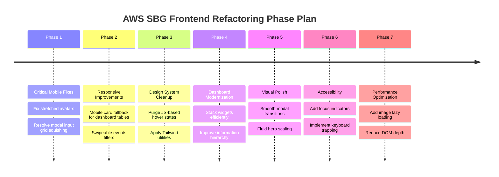

# AWS Student Builder Group Website — Complete UI/UX, Responsive, & Design System Audit

This document is a comprehensive, production-grade review of the **AWS Student Builder Group (SBG) Parul University** web application. It evaluates layout, typography, navigation, components, forms, tables, accessibility, performance, and dashboard workflows to align the project with industry-leading web experiences (e.g., Vercel, Stripe, Linear).

---

## Executive Quality Scores

| Quality Dimension | Score | Status |
| :--- | :--- | :--- |
| **Overall UI Quality** | **8.0 / 10** | **Good**: Modern styling base, but lacks animation polish and consistent design token utilization. |
| **Responsive Quality** | **7.8 / 10** | **Satisfactory**: Clean grid-based structures, but contains component-level stretching and overflow boundaries. |
| **Mobile Experience (320px - 425px)** | **7.5 / 10** | **Needs Improvement**: Inability to manage tables, forms, and highlights grid constraints gracefully. |
| **Tablet Experience (768px)** | **8.5 / 10** | **Very Good**: Solid layout adaptation, except for cards stretching on stack viewports. |
| **Desktop Experience (1024px - 1920px)** | **9.2 / 10** | **Excellent**: Visual alignment is superb on larger screen resolutions. |
| **Accessibility Compliance (WCAG)** | **6.5 / 10** | **Poor**: Lack of ARIA attributes, missing focus indicators, and custom state-based styling overrides keyboard navigation. |
| **Design System Consistency** | **7.5 / 10** | **Satisfactory**: Uses tailwind variables, but pollutes logic with manual JS-based hover states and inline style overrides. |
| **Dashboard Workflow & UX** | **7.8 / 10** | **Good**: Effective role separation, but features cramped modals and non-responsive tables. |

---

## Critical Issues (Production Blockers)

1.  **React Re-render Loops in Inputs & Buttons**
    *   *Root Cause*: Buttons (`onMouseEnter`/`onMouseLeave`) and inputs (`onFocus`/`onBlur`) rely on JavaScript event listeners to mutate state for style applications. In a large form (like `/certify`), every cursor movement or input focus triggers full component tree re-renders, causing noticeable typing latency on mobile devices.
    *   *Impact*: Heavy CPU usage and degraded scrolling performance on lower-end mobile devices.
2.  **Dashboard Table Horizontal Overflow**
    *   *Root Cause*: Members table uses a hardcoded `min-width: 700px` without viewport alternative rendering.
    *   *Impact*: Breaks horizontal constraints on mobile, forcing the user to swipe sideways to access vital action buttons (Approve, Revoke).
3.  **Avatar Distortion on Stacked Grids**
    *   *Root Cause*: `LeaderCard` and `RebrandPhoto` lack a `max-width` limit when grid layout collapses to single-column (`grid-cols-1`). The `aspect-ratio: 4/3` property expands the vertical height to over 500px on tablet sizes, resulting in massive, blurry, and pixelated placeholder avatars that dominate the screen.
    *   *Impact*: Visually unappealing layout distortion on Tablet and Mobile Large viewports.

---

## High Priority Improvements

1.  **Mobile-First Grid Refactoring**
    *   Highlights on the `/events` page must use `grid-cols-1 sm:grid-cols-2` instead of hardcoded `grid-cols-2` to prevent sentence text overlap.
    *   Dashboard modals should utilize stacked columns (`grid-cols-1 sm:grid-cols-2`) for input fields.
2.  **Replacement of JS Hover/Focus Actions with Tailwind Utilities**
    *   Refactor all buttons, cards, and input styling borders to rely on native Tailwind classes (e.g., `hover:border-[#AD5CFF]/60 hover:bg-[#AD5CFF]/10 focus:border-[#AD5CFF]`). This eliminates unnecessary React re-renders.
3.  **Mobile Member Card Layout in Dashboard**
    *   Provide a hidden-on-desktop card container (`block md:hidden`) that presents user status, department, and actions in modular stacked cards, replacing horizontal table scrolling.

---

## Medium Priority Improvements

1.  **Smooth CSS Transitions & Animations**
    *   Implement fade-in/scale-up micro-interactions on page navigation and modal open/close actions.
    *   Introduce smooth height transitions on the Navbar mobile menu dropdown.
2.  **Contrast & Typography Scaling**
    *   Audit light text color (`var(--text-subtle)`) to ensure compliance with WCAG AA minimum contrast ratio (4.5:1).
    *   Standardize headings using responsive font scaling variables (`text-2xl md:text-3xl lg:text-4xl`).

---

## Low Priority Improvements

1.  **Skeleton Screens for Loading States**
    *   Replace simple spinning loaders (`animate-spin`) with animated content skeletons (`animate-pulse` card outlines) for team listings and dashboard widgets to prevent page jerking during API fetching.
2.  **Keyboard Trapping & ARIA**
    *   Ensure dashboard modals block background interaction and focus keyboard inputs inside the active window.

---

## Page-by-Page Recommendations

### 1. Home Page (`/`)
*   **Current Score**: **8.8 / 10**
*   **Problems**: Hero section buttons wrap prematurely on Mobile Small (320px). Grid alignment of community collabs causes the right-aligned arrows to wrap and drop on narrow screens.
*   **Root Cause**: Flex containers lack appropriate wrap rules and horizontal margins are too generous on mobile.
*   **Recommended Fix**: Change layout padding to `px-4` on mobile and stack social action buttons vertically if viewport width is under 360px.
*   **Expected Result**: Clean layout flow without button wrapping or misaligned text columns.

### 2. About Page (`/about`)
*   **Current Score**: **7.2 / 10**
*   **Problems**: Avatars expand to full viewport width on mobile/tablet. Timeline vertical line is misaligned with milestone cards on mobile.
*   **Root Cause**: Lack of max-width constraints on card containers when grids collapse; timeline dot coordinates are static.
*   **Recommended Fix**: Apply `max-w-md mx-auto` to `LeaderCard` wrappers. Adjust mobile timeline absolute positions dynamically.
*   **Expected Result**: Symmetrical leadership layout and cleanly centered milestones.

### 3. Events Page (`/events`)
*   **Current Score**: **8.0 / 10**
*   **Problems**: Highlight bullets in the featured card get squeezed. Filter button text wraps on narrow devices, making labels illegible.
*   **Root Cause**: Grid columns are hardcoded to `grid-cols-2` and filters lack a scrolling overflow container on mobile.
*   **Recommended Fix**: Change grid style to `grid-cols-1 sm:grid-cols-2`. Wrap filters in a container with `overflow-x-auto whitespace-nowrap scrollbar-none`.
*   **Expected Result**: Easily readable highlights and swipe-friendly filter tabs on mobile.

### 4. Team Page (`/team` & `/team/[slug]`)
*   **Current Score**: **8.5 / 10**
*   **Problems**: Social buttons wrap and collide on small screens. Member profile layouts overlap the avatar image.
*   **Root Cause**: Negative margins (`-mt-10`) used to place names over images collide on screen sizes under 360px.
*   **Recommended Fix**: Change card margins to stack elements (`flex-col items-center text-center`) on mobile.
*   **Expected Result**: Premium profiles that render perfectly on small viewports.

### 5. Contact Page (`/contact`)
*   **Current Score**: **8.8 / 10**
*   **Problems**: Form columns squeeze names and emails side-by-side on tablet/mobile screens.
*   **Root Cause**: Input grid uses `sm:grid-cols-2` but the threshold should scale down at a larger width.
*   **Recommended Fix**: Standardize form grid structure to `grid-cols-1 sm:grid-cols-2`.
*   **Expected Result**: Spacious form fields that are easy to fill out on any touch device.

### 6. Certify Page (`/certify`)
*   **Current Score**: **8.2 / 10**
*   **Problems**: Monolithic multi-step forms require heavy vertical scrolling. Lack of auto-fill attributes and validation feedback on inputs.
*   **Root Cause**: Fields are packed without sectional dividers; JS state overrides focus behaviors.
*   **Recommended Fix**: Segment form fields into clear accordion tabs or step-indicators. Add HTML5 input validation.
*   **Expected Result**: Structured, easy-to-use form that guides users through verification steps.

### 7. Portal & Verify Pages (`/portal` & `/portal/verify`)
*   **Current Score**: **9.0 / 10**
*   **Problems**: Terminal console font size is too small on mobile, making command outputs hard to read.
*   **Root Cause**: Font sizes are fixed to `text-xs`.
*   **Recommended Fix**: Make console text responsive (`text-[10px] sm:text-xs`) and ensure output wrapping.
*   **Expected Result**: Interactive developer console that is fully readable on mobile.

### 8. Dashboard Layout & Pages (`/dashboard/*`)
*   **Current Score**: **7.8 / 10**
*   **Problems**: Members page requires horizontal table scrolling. Modals for event details are squeezed on mobile. Quick actions lack consistent button layout scaling.
*   **Root Cause**: Hardcoded minimum widths on tables and grids within modals.
*   **Recommended Fix**: Implement responsive card layouts for tables on mobile. Refactor modal grids to single columns on small viewports.
*   **Expected Result**: A clean dashboard UI that is fully manageable from a mobile phone.

---

## Component-by-Component Recommendations

| Component | Current Implementation | Review Decision | Recommended Refactor Action |
| :--- | :--- | :--- | :--- |
| **Buttons** | Inline style hover state mutation | **Improve** | Replace JS state styling with Tailwind `hover:` and `transition:` classes. |
| **Cards** | JS `onMouseEnter` border colors | **Improve** | Use native CSS/Tailwind transitions. |
| **Forms** | JS input border override focus state | **Improve** | Switch to native CSS/Tailwind focus rings. |
| **Tables** | Hardcoded table with `min-width: 700px` | **Split** | Keep table on `md:block` and build responsive card layout for mobile viewports. |
| **Navbar** | Static mobile menu open state | **Improve** | Add transition wrappers for height transition and fade animations. |
| **Timeline** | Static placement timeline nodes | **Improve** | Adjust positioning to prevent misalignment on small displays. |
| **Modals** | Instant pop-up overlay | **Improve** | Apply enter/exit CSS transitions. |
| **Skeletons** | Missing | **New** | Create pulse loading states for team listings and event listings. |

---

## Final Refactoring Roadmap

### Phase 1 — Critical Mobile Fixes
*   Fix the stretched avatar placeholders on `/about` page.
*   Resolve input field squishing in the `/dashboard/events` modal form.
*   Eliminate button wrapping issues in the Hero banner.

### Phase 2 — Responsive Improvements
*   Replace dashboard table horizontal scroll with card layout fallbacks on mobile viewports.
*   Introduce horizontal scrolling for event filters on small mobile screens.
*   Fix highlights text overlap on the featured upcoming event card.

### Phase 3 — Design System Cleanup
*   Remove JS state manipulation for hovers (`onMouseEnter`, `onMouseLeave`) and focus (`onFocus`, `onBlur`).
*   Standardize borders, colors, font sizes, and borders with design tokens.
*   Refactor inline styles into class names where possible.

### Phase 4 — Dashboard Modernization
*   Redesign the dashboard overview screen widgets for better information density.
*   Clean up quick actions and statistics summaries on mobile.
*   Optimize role-based layouts (Leader, Technical, Operations, Member) to keep crucial options thumb-reachable.

### Phase 5 — Visual Polish
*   Introduce entry/exit transition animations for all modals and menus.
*   Refine fluid scaling on headings using custom `clamp()` text tokens.
*   Enhine hover micro-interactions for links, buttons, and cards.

### Phase 6 — Accessibility (WCAG AA Compliance)
*   Add keyboard navigation to the mobile hamburger menu and dropdown items.
*   Implement keyboard trapping for dialog containers.
*   Audit light/dark mode variables to meet contrast guidelines.

### Phase 7 — Performance Optimization
*   Add skeleton loaders to team and certification listings.
*   Implement `loading="lazy"` on all avatar images.
*   Refactor state components to prevent unnecessary re-rendering during user interactions.
